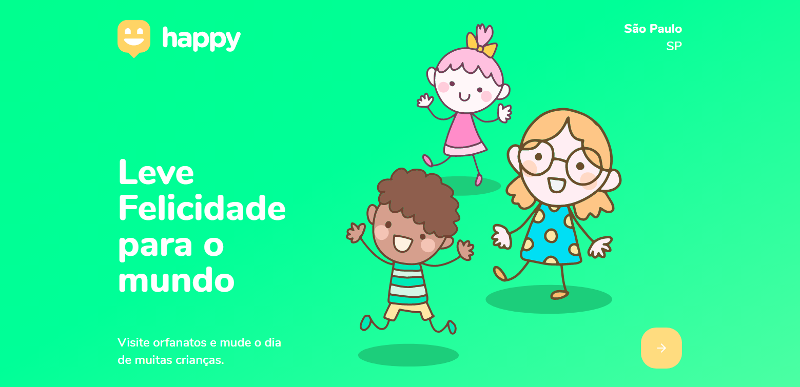
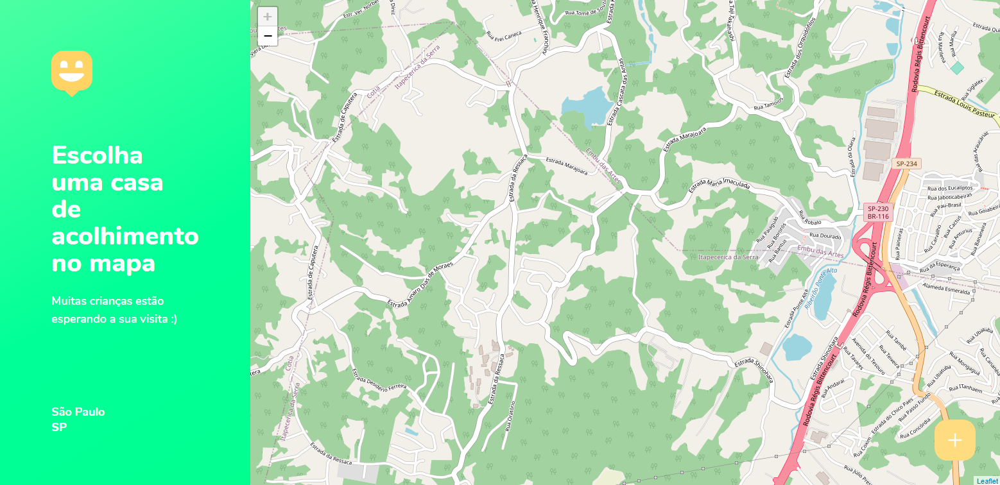

# Happy Versão K

Aplicação (web e mobile) que tem como 
objetivo conectar pessoas e serviços de 
acolhimento.

  

  

## O que é?

É uma versão criada por mim do projeto 
desenvolvido durante a Next Level Week 3.

## Tecnologias utilizadas

- Node.js
- React
- React Native
- Expo
- TypeScript

## Funcionalidades

- Cadastro de casas de acolhimento
- Busca de casas de acolhimento 
- Integração com API de mapa
- Aplicação multiplataforma (web e mobile)
- Aplicações conectadas ao backend

## Créditos

- [RocketSeat](https://github.com/rocketseat-education/): 
Responsável pela criação dos layouts da aplicação
e versão original (happy).